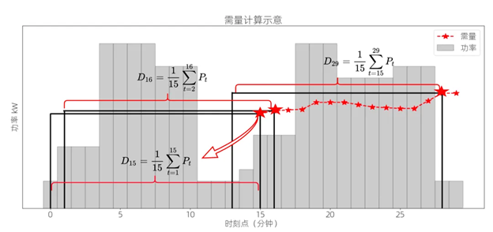

# Machine Learning

## 任务一  电力系统储能调度优化问题

### 背景描述

```
想象一下，未来的中国，电力系统正在经历一场“绿色革命”。国家提出了“双碳”目标，意思是我们要努力减少碳排放，争取在2035年先搭个“新型电力系统”的架子，到了2050年再把它彻底建好，变成一座“绿色电力大厦”。不过呢，这座大厦现在还处于“刚打地基”的阶段，尤其是新型储能系统，还在摸索怎么从“小打小闹”变成“大规模赚钱”。

目前，很多工商业储能公司正在玩一种叫“峰谷套利”的游戏。简单来说，就是趁着电费便宜的“谷时”（比如深夜），偷偷存电；等到电费贵的“峰时”（比如白天），再把电放出来卖给其他用户，赚个差价。听起来是不是有点像“低买高卖”的股票操作？只不过这里买卖的是电，而不是股票。

那么，电费是怎么算的呢？其实电费就像是一顿“电力大餐”，里面有很多“配料”：

市场化购电电费：你用了多少电，就付多少钱，按“分时电价”来算，有点像点菜按量收费。

输配电量电费：这部分也是按用电量来算，相当于“送餐费”。

输配容（需）电量电费：这个就比较特别了，它不是为了你用了多少电，而是为了补偿电力公司的“固定成本”，比如建变电站、修设备、运营维护等。这部分费用是根据你的变压器容量或者最大用电需求来算的，有点像“包月费”。如果你的变压器容量在315kVA以上，那你就得交这笔钱。

其他费用：比如系统运行费、政府基金、功率因数调整费、线损费等，这些就像是“附加小费”。

在本题中，我们主要关注的是“需量电费”。需量是什么呢？简单来说，就是你在一个15分钟的时间段内，平均用了多少电。电力公司会用一种叫“滑差”的方式来计算这个值，然后每个月挑出你用的最多的那个“需量”来算钱。

如果你和电力公司签了合同，规定了最大需量，那么：

如果你用的电超过了合同值的105%，超出的部分就要按双倍价格交钱，相当于“超量罚款”。

如果你没超过105%，那就按合同价交钱，算是“守规矩奖励”。

```



### 问题描述

负荷是指储能公司从每时每刻所必须要使用的电量的功率，包括卖给其他用户以及自己公司的各种用电需求。在进行峰谷套利之前，通过历史数据预测未来的负荷数据来提前制定储能的策略能够使储能公司有更好的利益。以下是数据的说明和负荷的计算：
附件分时电价数据.xlsx包括了浙江省近几年的各个时段的具体电价。
附件历史用电数据.csv则是包括了历史的用电数据，名字的后半部分表示储能设备的电柜数。具体内容如下所示：
date字段表示记录日期；
data字段表示记录的具体数据，用‘,’隔开；
system_id和system_type字段表示data的具体类型，如表1所示。

| system_id | system_type | 类型                             | 单位 |
| --------- | ----------- | -------------------------------- | ---- |
| -1        | Time        | 时间数据                         | /    |
| 1         | CN          | 储能用电数据（储能充放电的功率） | kW   |
| 4         | SD          | 市电数据（从电网取电的功率）     | kW   |

其中储能为正表示储能系统在充电，负表示储能系统在放电。
储能公司可以通过市电（SD）和储能（CN）的功率数据可以计算得到负荷的具体值。
负荷=市电-储能用电

必要的约束条件如下所示：
	储能系统约束说明：
	储能系统充放电功率有上限：单柜101.4 kw，二并柜201.5 kW，三并柜308.1 kW；
	储能系统有容量限制，每个电柜有215kW·h；
	储能系统不能同时充电和放电。

    其他约束说明：
	市电的获取必须满足用电负荷；
	最大需量不超过设定的合同最大需量的105%。

    可选的调度手段：
	确定合同最大需量；
	确定储能系统每时每刻充电或放电及其功率。

    优化目标：
	峰谷套利获得的利益（储能总放电电价-储能总充电电价）最大
	尽可能的降低需量电价成本

注：若你们团队有更好计算方式可忽略此提醒。提醒：可将上述两个目标通过以下方式综合为一个总优化目标：
        Max  总目标=峰谷套利收益-0.003*需量电价成本

### 问题描述

#### 问题一

```
想象一下，你是一个“电力预言师”，手里有三个储能设备，它们就像是三个“电力小精灵”。你的任务是预测这些小精灵未来一天（24小时）的“胃口”（也就是负荷）。

你需要以15分钟为一个周期，每15秒记录一次数据，就像每隔15秒给它们拍一张“电力快照”。

然后，根据历史数据，用你的“预言魔法”预测出它们未来一天的负荷。

最后，把预测结果保存在一个叫预测结果.xlsx的“魔法卷轴”里，放在对应的位置上。

任务目标：
成为最准的“电力预言师”，准确预测三个小精灵的未来负荷！
```

#### 问题二

```

现在，你不仅是“电力预言师”，还是一名“电力策略大师”。你的目标是让这三个储能小精灵在满足实际用电需求的前提下，尽可能多地赚钱！

你需要根据预测的负荷数据，设计一套“充放电策略”，告诉小精灵们什么时候该“吃饭”（充电），什么时候该“干活”（放电）。

你的策略要优化到让它们赚的钱比原来更多（原来的收益可以参考表2）。

最后，把优化后的策略和收益提升结果保存在预测结果.xlsx的“魔法卷轴”里。

任务目标：
让储能小精灵们赚得盆满钵满，同时别忘了记录下你比原来多赚了多少钱！
```
| 储能设备 | 需要电价/元 | 峰谷套利收益/元                             | 
| --------- | ----------- | -------------------------------- | 
| 单柜       | 26541.12       | 277.10                         |
| 二并柜        | 34983          | 626.61 | 
| 三并柜        | 37026          | 942.44     |   


#### 问题三

```
现在，故事进入高潮部分！你发现了一个“隐藏规则”：如果储能小精灵们的最大需量可以超过合同规定的105%，那么它们就能赚到更多钱！

你需要重新设计一套“充放电策略”，让它们在不违反规则的前提下，尽可能多地突破合同限制。

然后，计算一下新的策略能让它们多赚多少钱，并和原来的收益做个对比。

最后，把新的策略和收益提升结果保存在预测结果.xlsx的“魔法卷轴”里。

任务目标：
打破常规，让储能小精灵们在合法的范围内“放飞自我”，赚到更多钱！


```


## 任务二  生鲜配送的挑战

### 背景故事
```
在一个充满生鲜美食的世界里，冷藏运输是物流界的“超级英雄”。然而，这位英雄最近遇到了一些麻烦：能耗太高、成本太贵，生鲜商品在配送过程中还会因为时间太长或温度太高而“掉价”。为了拯救这些生鲜美食，我们需要设计一套完美的配送方案，既能保证食物的新鲜度，又能控制成本。

现在，一家生鲜企业把各种生鲜商品存放在配送中心，等待配送。当客户下单后，配送中心需要快速优化路线，把美食送到每个客户手中。常见的配送场景是：一辆车里既有常温产品，也有冷藏和冷冻产品（比如餐饮门店的多温区配送）。我们需要用隔温板、保温箱等工具，一次性完成所有产品的配送。

不过，配送过程中会有多次开关车门的动作，温度可能会波动。冷冻品要求温度保持在-18℃，冷藏品要求0-8℃，而且整个配送过程必须在4-8小时内完成，否则美食就会“变质”。在一个充满生鲜美食的世界里，冷藏运输是物流界的“超级英雄”。然而，这位英雄最近遇到了一些麻烦：能耗太高、成本太贵，生鲜商品在配送过程中还会因为时间太长或温度太高而“掉价”。为了拯救这些生鲜美食，我们需要设计一套完美的配送方案，既能保证食物的新鲜度，又能控制成本。

现在，一家生鲜企业把各种生鲜商品存放在配送中心，等待配送。当客户下单后，配送中心需要快速优化路线，把美食送到每个客户手中。常见的配送场景是：一辆车里既有常温产品，也有冷藏和冷冻产品（比如餐饮门店的多温区配送）。我们需要用隔温板、保温箱等工具，一次性完成所有产品的配送。

不过，配送过程中会有多次开关车门的动作，温度可能会波动。冷冻品要求温度保持在-18℃，冷藏品要求0-8℃，而且整个配送过程必须在4-8小时内完成，否则美食就会“变质”。
```

### 任务目标
```
我们的目标是：从车辆温区规划、路线规划等方面，设计一套多温区食品配送的优化方案，在保证食品安全和及时性的前提下，实现成本优化。
```

### 问题描述

#### 问题一
```
你是一名“配送指挥官”，手里有一支车队，任务是让这些车辆以最快的速度把生鲜美食送到每个门店。

所有车辆的速度都是60公里/小时，起点和终点都是配送中心。

每个门店至少要被“拜访”一次，而且整个配送过程不能超过8小时，否则美食就会“不新鲜”了。

你的目标是：用最少的车辆完成任务，同时规划出每辆车的行驶路线。

注意：这个问题只考虑车辆数量和路线规划，暂时不用管运输的食品量和成本。

任务目标：
设计一套“最少车辆+最优路线”的方案，让生鲜美食快速、高效地送到每个门店！

```

#### 问题二
```
现在，任务升级了！你不仅要考虑车辆数量和路线，还要考虑如何省钱。

你需要从车辆温区规划和路线规划两方面入手，设计一套多温区食品配送的优化方案。

在保证食品安全和及时性的前提下，尽可能降低配送成本。

你需要建立数学模型，计算出最优的车辆服务门店信息和行驶路线，并画出来。

任务目标：
在保证美食新鲜的同时，让配送成本降到最低，成为“省钱达人”！
```

## 附件
问题一与问题二的附件都在asserts文件夹中

## 推荐课程学习

+ [机器学习原理与实践](https://tianchi.aliyun.com/course/278?spm=5176.27080692.J_2095365020.2.748a5699lfzCsc)

+ [机器学习周志华](https://github.com/Mikoto10032/DeepLearning/blob/master/books/%E6%9C%BA%E5%99%A8%E5%AD%A6%E4%B9%A0%E5%91%A8%E5%BF%97%E5%8D%8E.pdf)

+ [图解机器学习](https://www.showmeai.tech/tutorials/34)

