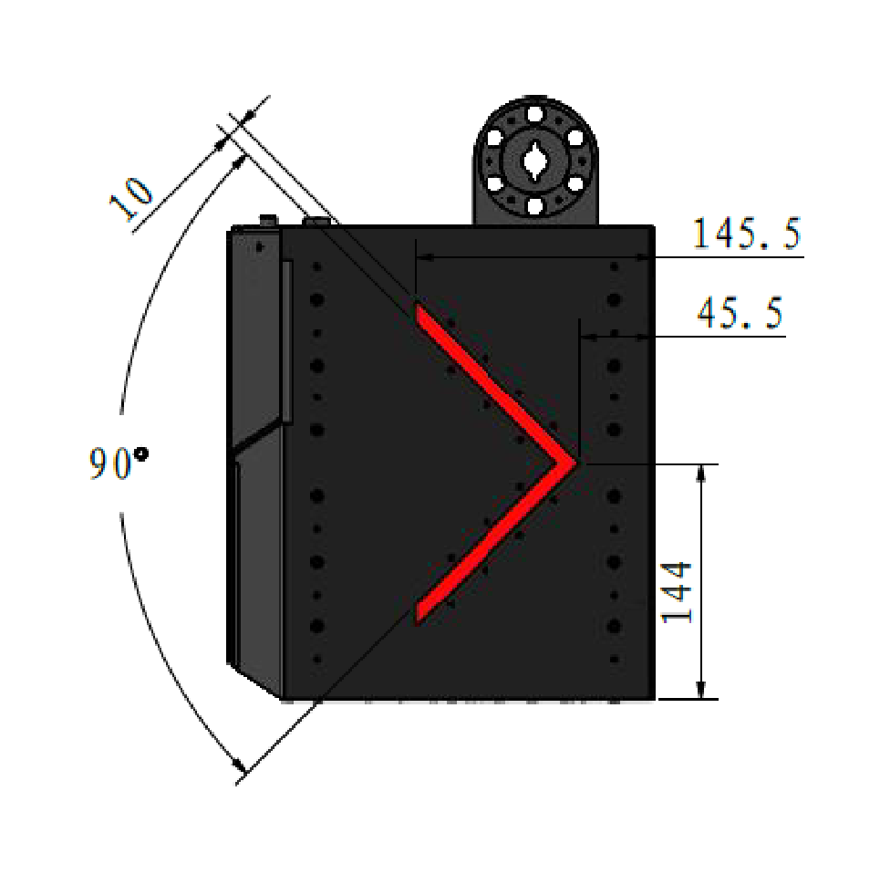

# opencv 考核任务

使用C++完成作业

## 1.番茄酱包识别

学长喜欢吃麦麦但是不吃番茄酱，于是桌上积攒了很多麦麦番茄酱。于是他想写一个番茄酱包计划毁灭程序，使用大弹丸摧毁过期番茄酱。请你为他编写一个识别程序的第一个模块：
检测和投影

识别番茄酱包，进行透视变换，参考长宽比2：1
参考结果：

## 图像降噪

学长的朋友发给他一张他喜欢的[歌](https://www.bilibili.com/video/BV1H3411t797?t=596.9)的封面图的高清版本，但是在经过多次手机拍屏/苹果手机截屏/宇宙射线攻击/微信降画质后，图片变得混沌。现在学长已经对其进行了喵喵处理，但是还有大量的噪声，请你完成最后一步：
图像降噪

原图低分辨率版：

## 灯条识别

对兑换槽侧面灯条识别

需要识别的图像在box文件夹下

要求：能够将灯条从噪声和/或其他条型部分中区分，包装成一个，函数输入为图像，输出为灯条6个角点（或其他可以描述灯条位置的数据）以及一个显示结果的图像。
